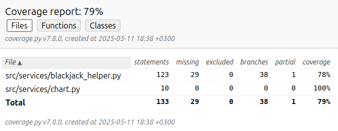

# Test Documentation

## Testing Approach

Testing was done in the following ways:

- **Automated**: Unit tests with the `unittest` framework
- **Manual**: Manual system-level testing

## Automated Testing

### Coverage (79%)

### Excluded from tests and coverage

- User interface
- All test files

### Test Classes

1. TestVerifyBlackjackChart - Chart validation tests
2. TestBlackjackHelperAskHelpCharts - Action selection logic tests
3. TestBlackjackHelperRules - Rule enforcement tests
4. TestChart - Chart data structure tests

### Chart Validation Tests (TestVerifyBlackjackChart)

- Valid chart structure passes verification
- Invalid outer keys raise ValueError
- Invalid inner keys raise ValueError
- Invalid action values raise ValueError

### Action Selection Tests (TestBlackjackHelperAskHelpCharts)

- Correct chart selection based on hand type:
  - Normal hands use normal chart
  - Pairs use split chart
  - All soft hands use soft chart
- Hard ace uses normal chart
- Default to STAND for unmatched cases

### Rule Enforcement Tests (TestBlackjackHelperRules)

- Rule effect verification:
  - DOUBLE_ALLOWED
  - DOUBLE_AFTER_SPLIT_ALLOWED
  - SURRENDER_ALLOWED
  - SPLIT_ALLOWED

### Chart Structure Tests (TestChart)

- Correct value retrieval
- Default value handling
- On-not-found value configuration

## Manual System Tests

### Environments

- Windows
- Linux

### Scenarios

- Invalid charts
- Changing charts
- Error for invalid chart
- All scenarios from [requirements](https://github.com/MarkusWahlman/blackjackHelper-Aht/blob/main/documentation/requirements.md)

## Improvement Opportunities

- Additional edge case coverage
- Filesystem operations are not currently tested
