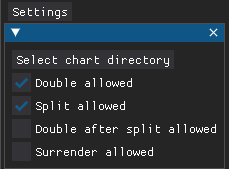
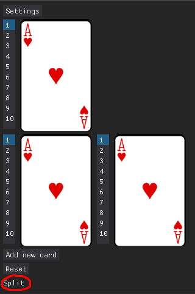

# User manual

Blackjack Helper is a tool designed to assist players make optimal decisions based on predefined blackjack strategy charts.

## Running the application

1. **Install dependencies:**

   This project uses the [Poetry dependency management tool](https://python-poetry.org/docs/#installation). Make sure you have installed it successfully.

   ```sh
   poetry install
   ```

2. **Start the application:**
   ```sh
   poetry run invoke start
   ```

## Configuration

Customize the game settings to match your table rules:  


1. **Select Strategy Chart**  
   Choose from predefined charts in the `charts/` directory. For example:

   - `charts/single_deck/hit_on_soft_17/` (Dealer hits on soft 17)
   - `charts/single_deck/stand_on_soft_17/` (Dealer stands on soft 17)

2. **Adjust Game Rules**  
   Configure options like:
   - Doubling allowed
   - Splitting allowed
   - Double after split
   - Surrender allowed

## How to Use

1. **Input Your Hand**  
   Select:

   - The dealer's upcard
   - Your two initial cards

2. **View Recommended Action**  
   The optimal move will display at the bottom:  
   

3. **Gameplay Actions**
   - **Hit**: Click "Add new card" for additional cards
   - **Split**: Play each hand separately (disable splitting/doubling if rules prohibit resplitting)
   - For other actions (stand, double, surrender), the hand concludes

## Creating Custom Strategy Charts

### File Structure

Create charts in this folder structure:

```
your_chart_name/
├── normal.json
├── soft.json
└── split.json
```

### Chart Format

Example (`normal.json`):

```json
{
  "1": {
    // Dealer upcard (Ace)
    "5": "H", // Player total 5 → Hit
    "12": "S" // Player total 12 → Stand
  }
}
```

### Action Codes

| Code | Meaning                                                  |
| ---- | -------------------------------------------------------- |
| H    | Hit                                                      |
| S    | Stand                                                    |
| Dh   | Double if allowed, otherwise stand                       |
| Ds   | Double if allowed, otherwise stand                       |
| P    | Split                                                    |
| Ph   | Split if double after split is allowed, otherwise hit    |
| Pd   | Split if double after split is allowed, otherwise double |
| Ps   | Split if double after split is allowed, otherwise stand  |
| Rh   | Surrender if allowed, otherwise hit                      |
| Rs   | Surrender if allowed, otherwise stand                    |

> These follow [Wizard of Odds](https://wizardofodds.com/games/blackjack/strategy/1-deck/) conventions

### Important Notes

- Missing combinations default to Stand ("S")
- Soft charts must include actions for totals like 12 (applicable when splitting is disabled)
- When reading charts online there may be no row for splitting 5s and 10s. You still need to add them to the split chart. You'll usually need to look up the correct action as a hard total from the normal chart
